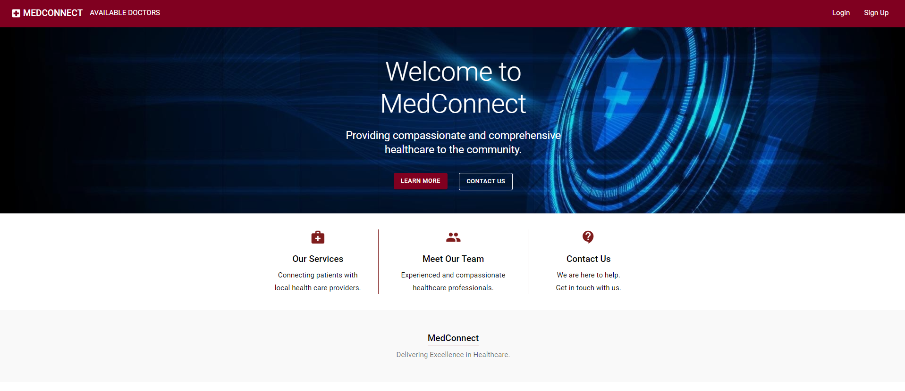
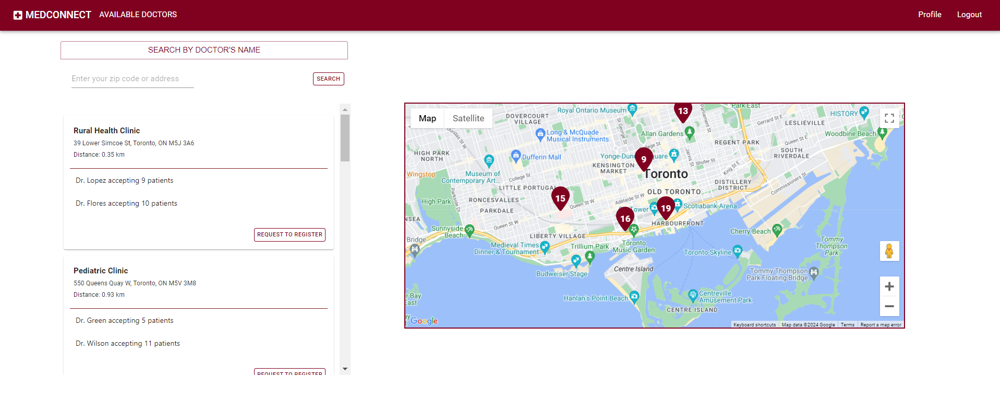
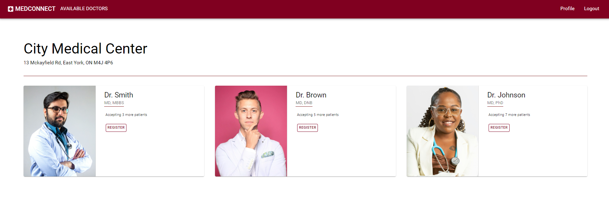
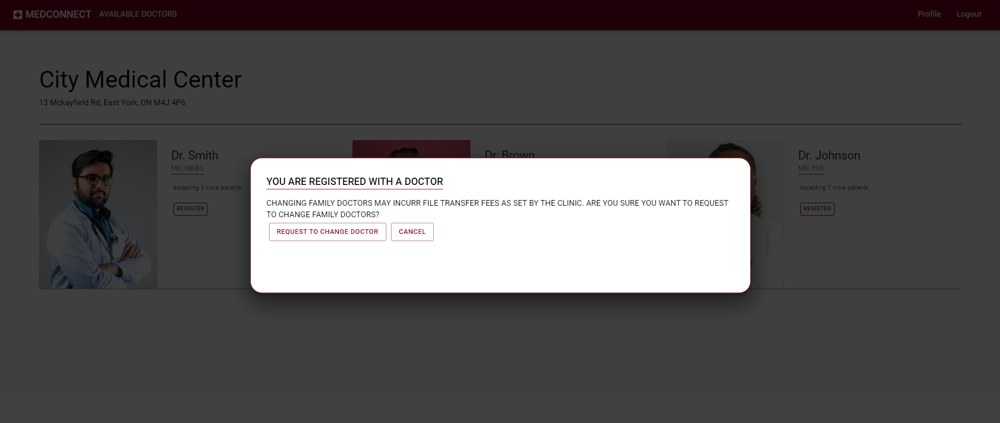
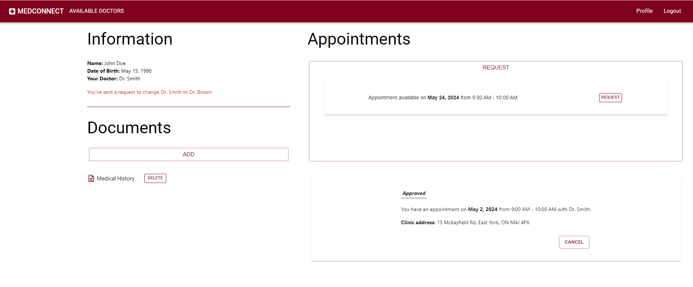
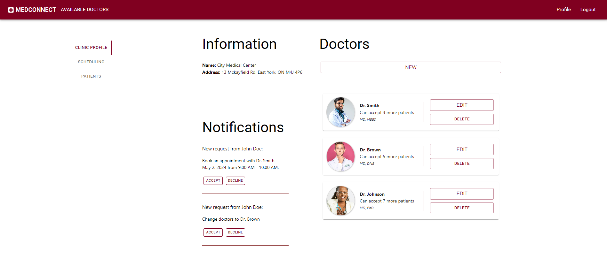
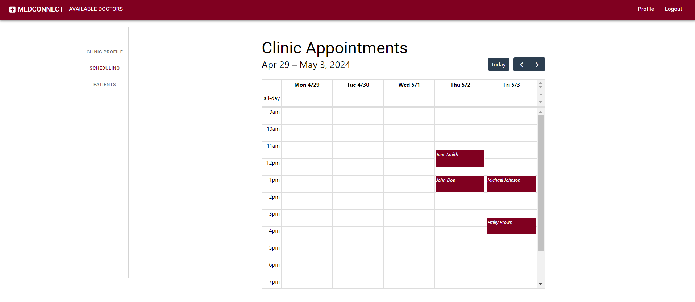
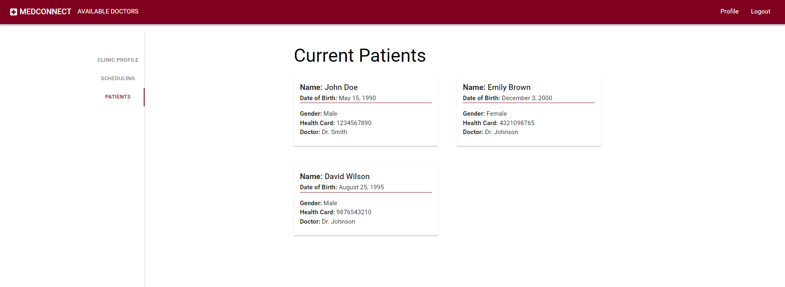

# MedConnect
MedConnect is a React-based single-page application (SPA) that allows patients to find available family doctors and connect with them. Users are able to register as patients or clinics in the app. Clinics can manage their roster of doctors, accept or decline registrations, change doctors and appointment requests from patients. Patients can search for doctors by name or by proximity to their location using an integrated Google Map.

## Final Product
Landing page


Available doctors Page


Register with doctor page


Request to change family doctors


Patient profile page


Clinic profile page


Scheduler


Clinic current patients



## Features

  * Users can sign up and register in the app by entering the required information. They can log in and see their information on the Profile page.
  * Users can view clinics on a map and see available doctors listed.
  * Users can search for doctors by name and by address or postal code. Clinics are sorted in the list by proximity to the searched address, and clinic distances to the address are displayed in the list.
  * Logged-in patients can request to register with a doctor. If the patient is already registered with a doctor, they can send a request to change doctors.
  * Patients can request an appointment with their doctor from their Profile page.
  * Clinics can accept or decline patient requests.
  * Clinics can create, read, update, and delete doctor profiles to manage the roster of the clinic's doctors.
  * The Full Calendar library is integrated into the app to manage appointments from the clinic's side of the app.
  * Clinics have access to their current patient list and patient information.


## Setup

Install dependencies with `npm install` in each respective `/frontend` and `/backend`.

## [Frontend]

Copy the `.env.local.example` file to `.env.local` and fill in the necessary configuration.

## Running Webpack Development Server

```sh
cd frontend
npm start
```

## [Backend]

## Creating The DB

Login to the PostgreSQL server. 

Create a database with the command `CREATE DATABASE medconnect;`.

Copy the `.env.example` file to `.env` and fill in the necessary PostgreSQL configuration. 


## Seeding

```sh
cd backend
npm run db:reset
``` 

## Running Backend Servier

```sh
cd backend
npm start
```
## Dependencies
* Frontend: 
  * "@emotion/react": "^11.11.4",
  * "@emotion/styled": "^11.11.5",
  * "@fullcalendar/interaction": "^6.1.11",
  * "@fullcalendar/react": "^6.1.11",
  * "@fullcalendar/timegrid": "^6.1.11",
  * "@mui/icons-material": "^5.15.16",
  * "@mui/lab": "^5.0.0-alpha.170",
  * "@mui/material": "^5.15.17",
  * "@mui/system": "^5.15.15",
  * "@mui/x-date-pickers": "^7.4.0",
  * "@react-google-maps/api": "^2.19.3",
  * "@testing-library/jest-dom": "^5.17.0",
  * "@testing-library/react": "^13.4.0",
  * "@testing-library/user-event": "^13.5.0",
  * "axios": "^1.6.8",
  * "crypto-js": "^4.2.0",
  * "dayjs": "^1.11.11",
  * "framer-motion": "^11.2.0",
  * "querystring": "^0.2.1",
  * "react": "^18.3.1",
  * "react-datetime-picker": "^6.0.1",
  * "react-dom": "^18.3.1",
  * "react-router-dom": "^6.23.0",
  * "react-scripts": "^5.0.1",
  * "use-places-autocomplete": "^4.0.1",
  * "web-vitals": "^2.1.4"

* Backend
  * "axios": "^1.6.8",
  * "bcrypt": "^5.1.1",
  * "bcryptjs": "^2.4.3",
  * "chalk": "^2.4.2",
  * "cookie": "^0.6.0",
  * "cookie-session": "^2.1.0",
  * "cors": "^2.8.5",
  * "dotenv": "^16.4.5",
  * "express": "^4.19.2",
  * "morgan": "^1.10.0",
  * "nodemon": "^3.1.0",
  * "parser": "^0.1.4",
  * "pg": "^8.5.0"
